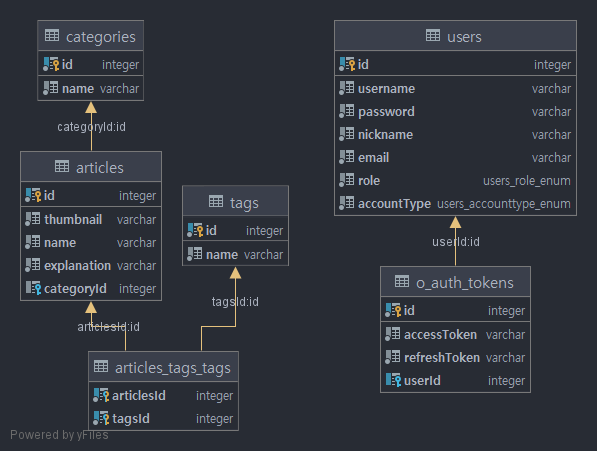

# ⛏️ 크래프트101

> 대부분의 서버가 개인으로 운영되는 마인크래프트 온라인 서버 운영에서 공식적으로 운영 중인 서버 정보를 다수에게 공유할 수 있는 서비스가 미흡하여 이를 해결하기 위하여 프로젝트 계획

포트폴리오용 마인크래프트 커뮤니티 사이트 [[DEMO]](https://www.gomi.land/)

## 1. 작업 기간

- 2021.1.27 ~ ing

## 2. 프로젝트 참여 인원

|            | 역할                    | 연락처                   |
| ---------- | ----------------------- | ------------------------ |
| 🦒 Juraffe | `Back-end`, `Front-end` | webmaster@mail.gomi.land |

## 3. 사용 기술

### Front-end

- React.js
- Tailwind CSS
- Apollo client

### Back-end

- Nest.js
- TypeORM
- Redis
- GraphQL
- Passport.js

## 4. ERD 설계

## 5. 프로젝트 구상도

~~프로젝트 구상도 준비 중~~

## 6. 핵심 기능

1. 리스트 형태의 등록된 서버 노출
2. 실시간 서버 상태 제공
3. Twitch API를 이용한 관련 방송 정보 제공

### 6.1 세부 기능

1. 서버 리스트 무한 스크롤 ([#cc4e720](https://github.com/aid95/craft101-webapp/commit/cc4e7202468cbc04b871a61e432d90fe207cab82))
2. 시간별 접속자 수 기록 및 그래프를 통한 통계 제공
3. Kakao Auth API를 활용한 인증 처리 ([#b7f4eac](https://github.com/aid95/craft101-webapp/commit/b7f4eace1f42b20710074e684891acf1554d8fb1), [#6504418](https://github.com/aid95/craft101-webapp/commit/6504418c9268df9f726b6e16f9c407677e076ee0))
